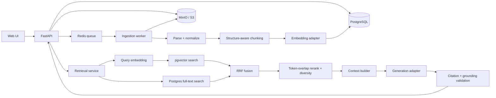

# Custom RAG application architecture and roadmap

## Decision

Build a provider-neutral RAG system in which we own ingestion, parsing, chunking, embeddings, storage, retrieval, ranking, context assembly, citations, and deletion.

OpenAI may optionally supply embeddings and answer generation, but it does not own the vector store or retrieval pipeline. Both model roles sit behind interfaces and can be replaced by local or other hosted models.

This document distinguishes the working MVP from the production-hardening work that remains.

## Implemented stack

| Concern | MVP choice | Why |
| --- | --- | --- |
| API | Python 3.12 + FastAPI + Pydantic | Typed, async-friendly API with strong Python ML support |
| Metadata and vectors | PostgreSQL + pgvector | One transactional store for documents, chunks, jobs, metadata, ACLs, full-text search, and vectors |
| Vector index | pgvector HNSW with cosine distance | Good speed/recall trade-off and no training phase |
| Keyword retrieval | PostgreSQL full-text search (`tsvector`) | Enables hybrid search without a second search service |
| Raw files | MinIO locally; S3-compatible storage in production | Immutable originals, easy production migration |
| Jobs | Celery + Redis | Background ingestion outside the request path and horizontally scalable workers |
| Embeddings | Provider interface; keyless feature hashing by default, OpenAI `text-embedding-3-small` optionally | Runs without a key while preserving a production-quality semantic option |
| Reranking | Deterministic token-overlap adapter | Improves ordering locally and keeps the reranker replaceable |
| Generation | Provider interface; keyless extraction by default, OpenAI Responses API with `gpt-5.6-luna` optionally | The generator receives only our selected evidence |
| UI | Static HTML, CSS, and JavaScript served by FastAPI | A responsive browser client without a separate frontend service |
| Local runtime | Docker Compose | Reproducible API, worker, Postgres, Redis, and MinIO services |

Use Qdrant instead of pgvector only when measurements show that very large vector collections, high sustained retrieval QPS, or native dense+sparse/multivector search justify operating a dedicated vector database.

## System shape



## Ingestion pipeline

### 1. Accept and register

`POST /api/documents` performs only the short request-time work:

1. Resolve the tenant/collection (the local build uses a single default tenant).
2. Validate the extension, file size, and upload limits.
3. Read the size-limited upload and write it under a content-addressed object key; never use the client filename as a storage path.
4. Calculate SHA-256 while streaming.
5. Create an immutable document version and ingestion job.
6. Return `202 Accepted` with `document_id`, `version_id`, and `job_id`.

An identical hash in the same tenant and collection is an idempotent no-op. The current upload endpoint creates a new document and immutable first version for changed content; attaching later versions to an existing document is a planned API extension.

### 2. Parse into structural blocks

MVP formats:

- PDF with a text layer: PyMuPDF
- DOCX: `python-docx`
- Markdown and TXT: direct parsers with deterministic common-encoding fallbacks
- HTML: Python standard-library `HTMLParser`

Scanned PDFs become `NEEDS_OCR`; they are not silently indexed as empty documents. OCR, PPTX, spreadsheets, email, image understanding, and advanced table extraction can be added as separate parser adapters.

Every parser emits ordered blocks with this contract:

```text
kind              heading | paragraph | list | table | code
text              normalized block text
page              optional page number
section_path      heading breadcrumb
source_locator    parser-specific location data
order             stable source order
```

Normalization fixes Unicode, line endings, NUL/control characters, repeated PDF headers/footers, and obvious line-wrap hyphenation. It preserves lists, code, tables, casing, and paragraph boundaries.

### 3. Chunk without losing provenance

Initial tunable defaults:

- Target: 500 tokens
- Hard maximum: 750 tokens
- Minimum preferred size: 100 tokens
- Prose overlap: 75 tokens

Split by section, paragraph, list, table, or code boundaries before using sentence-level splitting. Do not combine unrelated sections just to reach a target size. Oversized tables and code blocks receive type-aware splitting.

Two representations are retained:

- `text`: clean source text used for display, citations, and LLM context.
- `embedding_text`: document title + section breadcrumb + source text, used only to produce the vector.

Each chunk retains the document version, ordinal, page range, heading breadcrumb, block type, token count, content hash, and source locator.

### 4. Embed, validate, and publish

1. Batch up to 64 chunks while also enforcing a total-token ceiling.
2. Validate vector count, dimensions, and finite values.
3. Upsert deterministic point IDs derived from version and chunk identity.
4. Verify expected chunk/vector counts.
5. Atomically switch the document's `current_version_id` and mark the revision `READY`.

Bounded concurrency plus provider-aware retry/backoff is a production-hardening follow-up; the current worker records failures without publishing partial indexes.

Retrieval sees only `READY`, current versions. A partial or failed ingestion is never searchable.

## Retrieval pipeline

### 1. Prepare the query

- Unicode-normalize and collapse accidental whitespace.
- Preserve identifiers, numbers, punctuation, and the original query.
- Apply the required tenant filter, plus collection and requested-document filters, inside each database query before ranking.
- The internal retrieval filter type also supports tags and creation dates for later API expansion.

### 2. Generate candidates

The query must use the exact active embedding provider, model, dimensions, normalization, and preprocessing used for indexed chunks.

Initial candidate settings:

- Dense cosine search: top 40 per query variant
- PostgreSQL full-text search: top 40
- Fuse ranks with reciprocal rank fusion (RRF), initially weighted 65% dense and 35% lexical
- Keep the best 30 unique chunks

Dense similarity and lexical ranking scores are not directly averaged because they are on incompatible scales. Hybrid retrieval is included from the start so codes, names, dates, and acronyms are not lost by semantic search.

### 3. Rerank and diversify

- Rerank the fused top 30 against the original question with the local token-overlap adapter.
- Remove exact duplicate chunk hashes and near duplicates.
- Apply maximal marginal relevance with an initial lambda of 0.75.
- Select roughly eight primary chunks.
- Cap repeated evidence from one document or section.

These are starting values, not universal constants. Evaluation data will determine the final settings.

### 4. Assemble context

- Start with an evidence budget around 6,000 tokens, separate from instructions and response space.
- Pack strongest evidence first and prevent one document from consuming the entire budget.
- Give every passage an immutable label such as `[S1]` plus filename, page/section, document ID, version ID, and chunk ID.
- Treat all retrieved document text as untrusted reference data, never as instructions.

### 5. Generate and validate

The generation model receives only the question, conversation needed to understand it, and our assembled evidence. It must:

- Answer only from supplied evidence.
- Cite every material factual claim with supplied source labels.
- State when evidence is missing, partial, stale, or conflicting.
- Ignore instructions found inside source documents.

Request structured output containing the answer, cited source IDs, confidence, missing information, and an abstention flag. The server rejects citation IDs that were not present in the context and can regenerate once when grounding validation fails. A cross-encoder can later replace the local reranker through the same interface.

Initial abstention thresholds will be configurable and calibrated against the actual corpus. Low similarity alone is not a universal test; the reranker score, exact critical values, evidence sufficiency, and answerability evaluation all contribute.

### 6. Handle exact aggregation explicitly

Semantic top-k retrieval cannot reliably answer complete-corpus questions such as “How many times is the word `ISTQB` written?” because it may omit less relevant chunks, while overlapping chunks may duplicate the same occurrence. For an explicit word or phrase count, the API therefore reparses every selected original file and counts its normalized, non-overlapping source blocks deterministically. The response still includes page/section evidence, but no LLM is asked to estimate the total.

## Core data model

### `documents`

- `id`, `tenant_id`, `collection_id`
- display filename and title
- lifecycle status
- `current_version_id`
- timestamps and optional soft-delete time

### `document_versions`

- `id`, `document_id`, immutable SHA-256, blob URI, MIME type, size
- parser, normalizer, chunker, and embedding pipeline versions
- embedding provider, model, dimensions, distance metric, normalization
- index generation, expected chunk count, status, error details, timestamps

### `chunks`

- `id`, `version_id`, ordinal, canonical text, embedding text
- token count, content hash, block type
- page range, section path, source locator JSON
- embedding vector and generated full-text-search vector
- tenant/collection/ACL columns required for pre-filtering

### `ingestion_jobs`

- `id`, `version_id`, stage, status, checkpoint
- attempt count, lease owner, heartbeat, error code/message
- created, started, and finished timestamps

### Planned `retrieval_traces`

This table is not part of the initial migration. A production observability iteration should persist:

- redacted original/rewritten query and applied filters
- embedding/index/prompt versions
- dense, lexical, fusion, and rerank scores by candidate ID
- selected context IDs and token count
- citations, abstention reason, latency, token usage, and user feedback

## Lifecycle and consistency

```text
UPLOADED -> QUEUED -> PARSING -> CHUNKING -> EMBEDDING -> INDEXING -> READY
```

Failure/terminal states include `REJECTED`, `NEEDS_OCR`, `FAILED_PARSE`, `FAILED_EMBED`, `FAILED_INDEX`, `CANCELLED`, `DELETING`, and `DELETED`.

- Deterministic chunk IDs and replace semantics make a repeated full ingestion safe; automatic checkpoint resume is future hardening.
- The schema records model, dimension, parser, chunker, and index-generation identity. A configuration change requires an explicit reindex workflow, which is a roadmap endpoint.
- Incompatible embeddings are never mixed in one active index.
- Deletion first marks the document unavailable to retrieval, then removes the raw object and chunks before returning. It keeps only a soft-delete tombstone.

## Service interfaces

Business logic depends on small internal ports rather than LangChain or a vendor SDK:

```text
BlobStore
Parser
Normalizer
Chunker
EmbeddingProvider
IngestionRepository
RetrievalRepository
Reranker
ContextBuilder
Generator
```

OpenAI, local deterministic models, PostgreSQL/pgvector, MinIO/S3, and queue clients live behind adapters. This keeps provider changes bounded. Sentence-transformer, cross-encoder, and Qdrant adapters are possible follow-ons, not current dependencies.

## API surface

```text
GET    /api/health                   dependency health
POST   /api/documents                upload and enqueue ingestion
GET    /api/documents                list documents and ingestion states
GET    /api/documents/{id}           document/version/status details
DELETE /api/documents/{id}           remove the source blob and searchable chunks
GET    /api/jobs/{id}                ingestion progress/failure details
POST   /api/retrieval/search         inspect retrieval without generation
POST   /api/answers                  retrieve, rerank, and generate an answer
```

Keeping `/api/retrieval/search` separate makes retrieval testable and debuggable without paying for or depending on an LLM call. Reindex and answer-feedback endpoints remain production-roadmap items.

## Current repository layout

```text
src/rag/
  api/                 FastAPI routes and request/response schemas
  ingestion/           orchestration, normalization, and chunking
  ingestion/parsers/   format-specific parsers
  retrieval/           dense/lexical search, fusion, reranking, diversity
  adapters/            Postgres, blob stores, queues, OpenAI, local models
  worker/              durable ingestion and cleanup tasks
web/                   static browser client
migrations/            Alembic database migrations
tests/unit/             deterministic component tests
scripts/                live-stack smoke test
```

## Recommended production quality gates

Before tuning, create 75–150 labeled questions including paraphrases, identifiers, multi-document questions, conflicting versions, and at least 20–30% unanswerable or prompt-injection cases.

Track:

- Retrieval: Recall@5/10/30, MRR, nDCG@10, reranker lift, and ACL leakage (must be zero).
- Answers: correctness, faithfulness, citation precision/recall, unsupported claims, and abstention precision/recall.
- Operations: p50/p95 latency, embedding/generation tokens, cost, job failures, retries, and queue age.

Acceptance tests include duplicate-upload idempotency, deterministic retry IDs, exclusion of partial indexes, atomic version switching, immediate retrieval removal on deletion, valid page/section provenance, dimension mismatch rejection, and zero cross-tenant retrieval.

## Delivery status and next steps

### Completed MVP

- Docker Compose: FastAPI, worker, PostgreSQL/pgvector, Redis, MinIO
- TXT, Markdown, HTML, DOCX, and text-PDF ingestion
- Structure-aware chunker and OpenAI embedding adapter
- Dense retrieval and retrieval-debug endpoint
- PostgreSQL lexical retrieval and RRF hybrid fusion
- Token-overlap reranking, diversity selection, context budgeting, structured citations, and abstention
- Responsive UI for upload, status, questions, and evidence inspection
- Deterministic unit tests and a live-stack smoke test

### Next — answer-quality evaluation

- Build a labeled golden question set and evaluation runner
- Tune retrieval, ranking, context, and abstention thresholds on that set
- Optionally add a local cross-encoder reranker and persist retrieval traces

### Later — production hardening

- Authentication, tenant/ACL enforcement, quotas, malware scanning, parser isolation
- OCR and richer table/file support
- Monitoring, dead-letter replay, backups, retention, and deployment automation
- Load testing and optional Qdrant adapter if measurements justify it

## Sources informing the choices

- [OpenAI vector embeddings guide](https://developers.openai.com/api/docs/guides/embeddings)
- [pgvector documentation](https://github.com/pgvector/pgvector)
- [PostgreSQL full-text search documentation](https://www.postgresql.org/docs/current/textsearch.html)
- [Qdrant hybrid search documentation](https://qdrant.tech/documentation/search/text-search/hybrid-search/)
- [Qdrant filtering documentation](https://qdrant.tech/documentation/search/filtering/)
